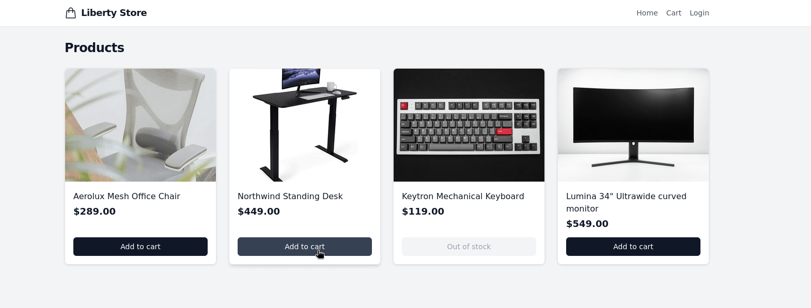
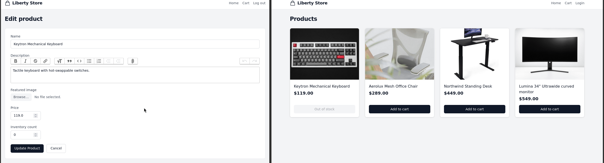

# Liberty Store

A modern e-commerce store with a fast, reactive interface. Browse the catalog, add products to your cart, check out as a guest, and subscribe to out-of-stock items.


## Table of Contents

- [Tech Stack](#tech-stack)
- [Features](#features)
   - [Catalog & Product Management](#catalog--product-management)
   - [Search, Filtering & Sorting](#search-filtering--sorting)
   - [Back-in-Stock Alerts](#back-in-stock-alerts)
   - [Shopping Cart](#shopping-cart)
   - [Live Stock Updates](#live-stock-updates)
   - [Checkout](#checkout)
- [Getting Started](#getting-started)
- [Development](#development)
   - [Code Quality & Testing](#code-quality--testing)
   - [Deployment](#deployment)
- [Roadmap](#roadmap)

## Tech Stack

### Backend
- Ruby 3.4.3
- Ruby on Rails 8.0
- PostgreSQL

### Frontend
- Hotwire (Turbo + Stimulus)
- Tailwind CSS
- Propshaft asset pipeline
- Import maps (ESM JavaScript)

### Authentication
- `has_secure_password` (bcrypt)
- Rails 8 authentication generator (session-based)

### Content & File Storage
- Action Text (rich-text product descriptions)
- Active Storage + `image_processing` (image uploads and variants)

### Background Jobs & Email
- Solid Queue
- Action Mailer

### Caching & Real-Time
- Solid Cache
- Solid Cable (WebSockets)

### Testing & Code Quality
- RSpec
- FactoryBot
- RuboCop (Rails Omakase)
- Brakeman

### DevOps & Deployment
- Docker
- Kamal

## Features

### Catalog & Product Management

A public catalog with authenticated management. Each product carries a name, an inventory count, a rich-text description (Action Text), and a featured image (Active Storage).

- Guests can browse all products without logging in.
- Authenticated users can create, edit, and delete products.
- Descriptions support embedded formatting and media via Action Text.
- Featured images are uploaded through Active Storage with on-the-fly variants.

### Search, Filtering & Sorting

A sidebar of filters that narrows the catalog live.

- Live search by name, debounced and submitted as you type (Stimulus).
- In-stock filter to hide sold-out products, and a price range (min/max) to bracket results.
- Sorting by price (low→high, high→low) or name; in-stock products always lead the list regardless of sort.
- Pagination (Pagy) keeps each page to 24 products, with prev/next hidden when there's nowhere to go.
- All filters combine into a single query and re-render only the catalog grid via a Turbo Frame; the URL updates in place so any filtered view is shareable and back-button friendly.

### Back-in-Stock Alerts

When a product is out of stock, visitors can subscribe to be notified when it returns.

- The product page shows a subscription form while inventory is `0`.
- When inventory goes from `0` to a positive number, every subscriber is emailed.
- Emails are delivered from a background job (Solid Queue) so requests stay fast.
- Each email includes a secure, token-based unsubscribe link.

### Shopping Cart

A guest cart that updates live as you shop.

- Add products from the catalog or the product page; the nav badge ticks instantly via Turbo Streams.
- Change quantities and remove items on the cart page; the row, line total, cart total, and badge all update in place.
- The cart persists in a signed, long-lived cookie backed by a database record.
- Every action falls back to a standard redirect when JavaScript is unavailable.



### Live Stock Updates

Stock status updates in real time, pushed over WebSockets.

- When an admin changes inventory, the change broadcasts over Action Cable to everyone viewing the product page or the catalog.
- The stock partial flips between "Out of stock / notify me" and "in stock / add to cart" in place.



### Checkout

Guest checkout that turns a cart into an immutable order.

- Place an order with a name and email.
- Each line snapshots the product's price at purchase time, so the order stays an accurate record even if prices change later.


## Getting Started

1. **Clone the repository**
   ```bash
   git clone https://github.com/xOviwyRx/liberty-store.git
   cd liberty-store
   ```

2. **Install dependencies**
   ```bash
   # System packages (Debian/Ubuntu): PostgreSQL client headers for the pg gem,
   # and libvips for Active Storage image variants
   sudo apt-get install -y libpq-dev libvips42t64
   bundle install
   ```

3. **Set up the database**

   Requires a running PostgreSQL. By default the app connects as `postgres` / `postgres` on `localhost:5432` — override with `DB_HOST`, `DB_USERNAME`, and `DB_PASSWORD` if your setup differs.
   ```bash
   bin/rails db:setup
   ```
   This creates the databases, loads the schema, and (in development) seeds an admin user and sample products.

4. **Start the app** (Rails server + Tailwind watcher)
   ```bash
   bin/dev
   ```
   Then open http://localhost:3000

5. **Log in** to manage the catalog using the development admin seeded in the previous step (credentials are in `db/seeds.rb`).

## Development

### Code Quality & Testing

```bash
bundle exec rspec  # model and request specs
bin/rubocop        # Rails Omakase style
bin/brakeman       # static security analysis
```

### Deployment

Configured for [Kamal](https://kamal-deploy.org):

```bash
export KAMAL_REGISTRY_PASSWORD=your-token
bin/kamal setup    # first deploy
bin/kamal deploy   # subsequent deploys
```

Configure SMTP for outgoing email in `config/environments/production.rb`.

## Roadmap

- [x] Shopping cart with live Turbo Stream updates
- [x] Live stock status via Turbo Stream broadcasting
- [x] Product search, filtering, and pagination with Turbo Frames
- [ ] Slide-out cart drawer that opens on add-to-cart (Stimulus + Turbo Streams)
- [x] Orders and checkout
- [ ] Full internationalization (English + Spanish)
- [ ] Dark mode with system theme support
- [ ] Deploy live

## License

[MIT](https://opensource.org/licenses/MIT)
